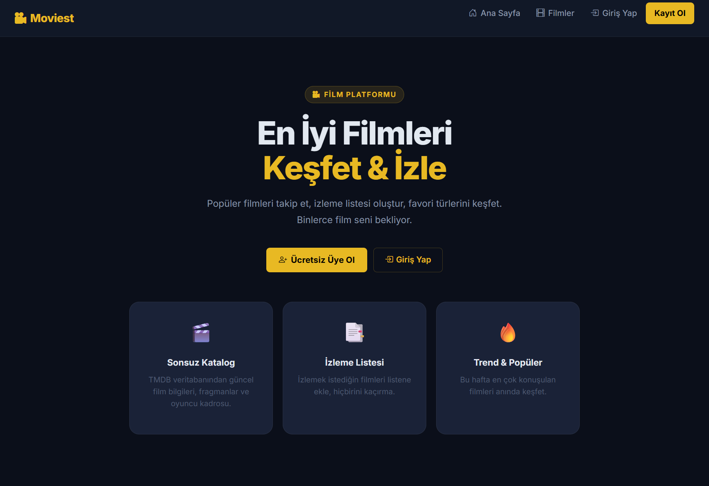
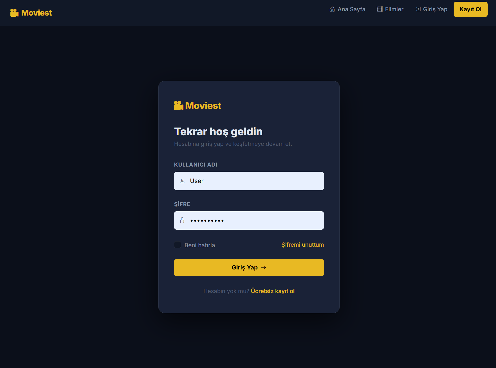
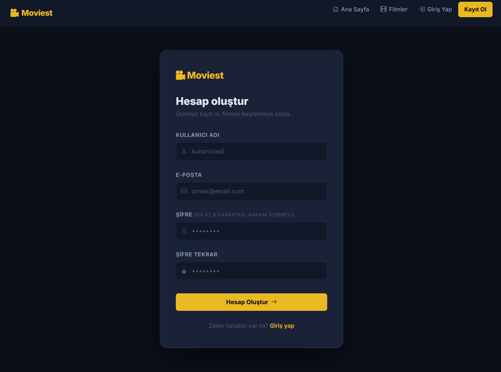
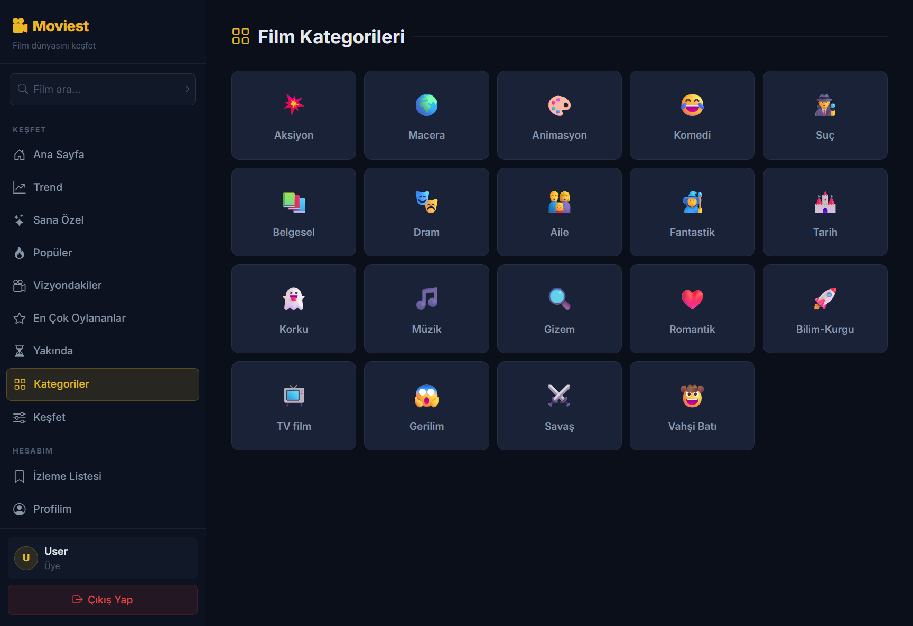
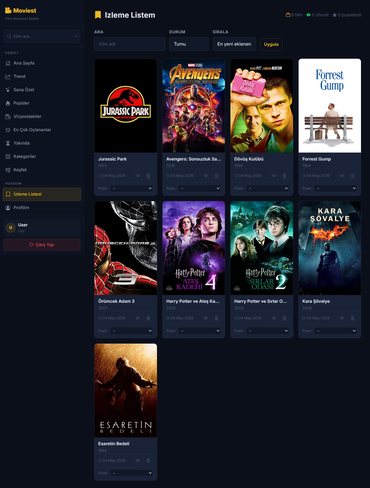
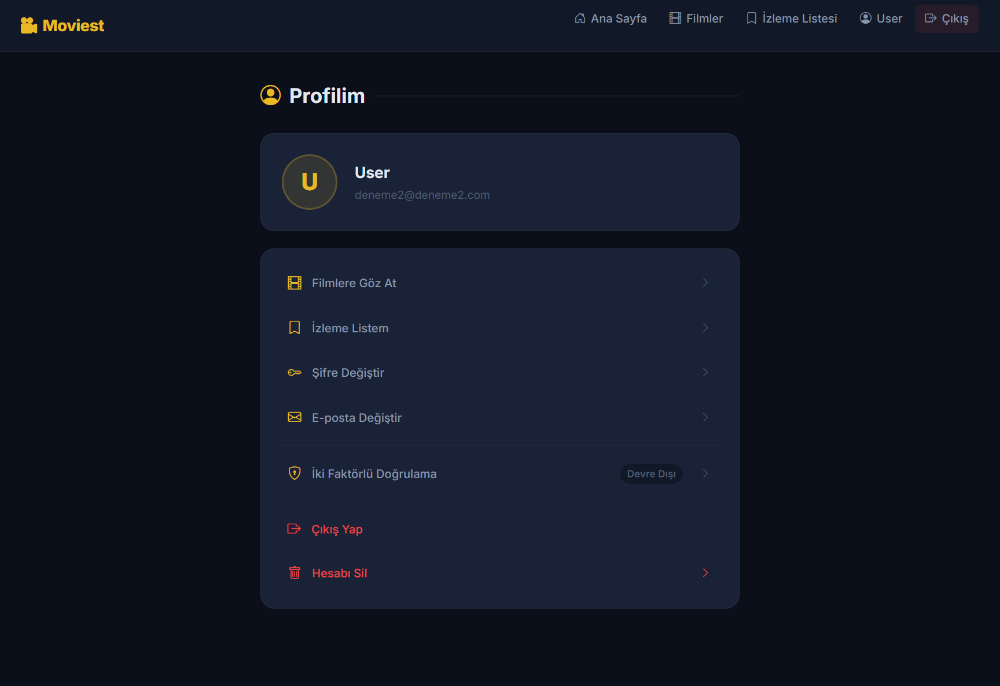
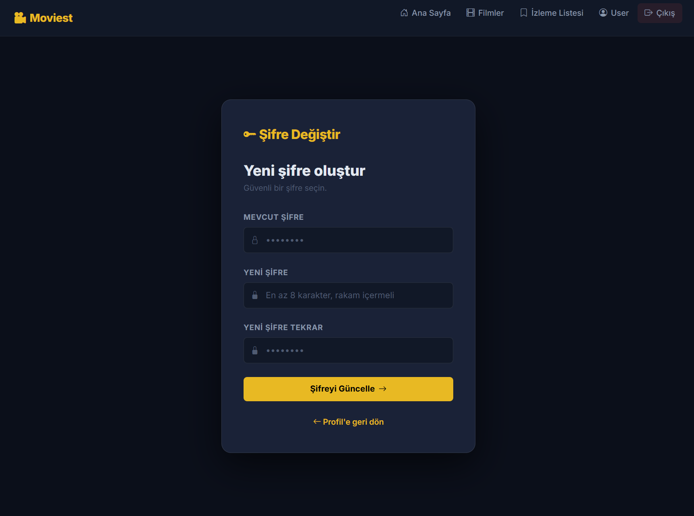
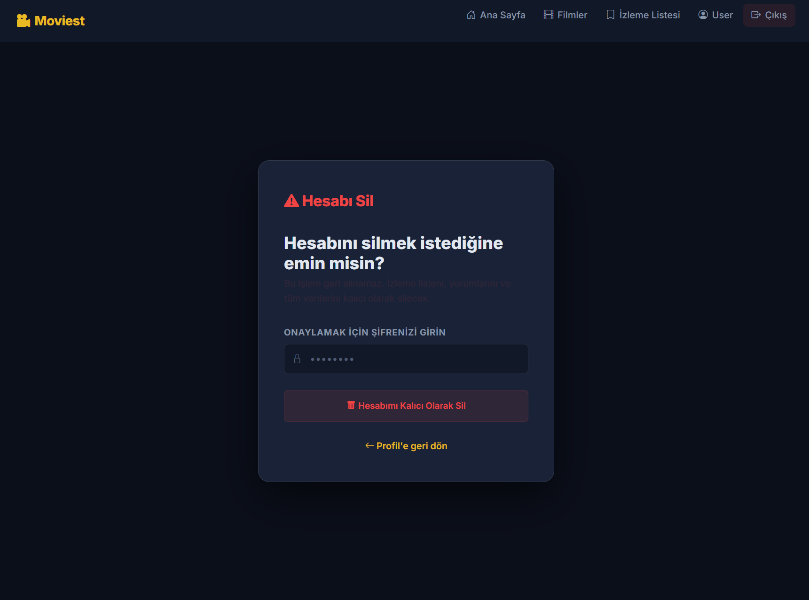

# Moviest

A Turkish-language film discovery platform built with ASP.NET Core 8 MVC. Browse popular, trending, and upcoming movies, manage a personal watchlist, and explore actor profiles — all powered by the TMDB API.

## Screenshots

<table>
  <tr>
    <td colspan="2"></td>
  </tr>
  <tr>
    <td></td>
    <td></td>
  </tr>
  <tr>
    <td></td>
    <td></td>
  </tr>
  <tr>
    <td></td>
    <td></td>
  </tr>
  <tr>
    <td colspan="2"></td>
  </tr>
  <tr>
    <td></td>
    <td></td>
  </tr>
  <tr>
    <td></td>
    <td></td>
  </tr>
</table>

## Features

- **Movie Discovery** — Popular, now playing, top rated, upcoming, and weekly trending movies with pagination
- **Search** — Full-text search with sorting (by rating, year, title) and minimum rating filter; live autocomplete in the sidebar
- **Genres** — Browse movies by genre category
- **Movie Details** — Poster, overview, cast, trailers (embedded YouTube), and similar movies
- **Actor Profiles** — Actor biography, birth info, and full filmography
- **Watchlist** — Add/remove movies; mark as watched; leave a personal rating (1–10); filter and sort
- **Reviews** — Leave a 1–10 rating and written review on any movie detail page
- **Recommendations** — Personalized movie recommendations based on your watchlist
- **Discover** — Filter movies by genre, year range, minimum rating, and sort order
- **Authentication** — Register, login, logout with ASP.NET Core Identity; optional email verification on registration
- **2FA** — TOTP-based two-factor authentication via any authenticator app
- **Account** — Profile view, password change, email change, account deletion, personal statistics (watchlist & review analytics)
- **Forgot Password** — Email-based password reset flow (requires SMTP configuration)
- **Admin Panel** — User statistics dashboard and user management (delete regular users)

## Tech Stack

| Layer | Technology |
|-------|-----------|
| Framework | ASP.NET Core 8 MVC |
| ORM | Entity Framework Core 8 + SQL Server |
| Auth | ASP.NET Core Identity (TOTP 2FA) |
| External API | TMDB (The Movie Database) v3 |
| Email | MailKit (SMTP) |
| Frontend | Bootstrap 5.3, Bootstrap Icons 1.11 |
| Caching | In-memory cache (IMemoryCache) |

## Security

- Security headers middleware (CSP, X-Frame-Options, X-Content-Type-Options, Referrer-Policy, Permissions-Policy)
- Rate limiting: auth endpoints 10 req/5 min, API endpoints 60 req/min
- Account lockout after 5 failed login attempts (15-minute cooldown)
- Anti-CSRF tokens on all state-changing requests
- HTTPS redirect + HSTS in production
- HttpOnly, Secure, SameSite=Lax auth cookie
- Watchlist items are strictly scoped to the authenticated user
- Password required to confirm sensitive actions (email change, account deletion, password reset)

## Prerequisites

- [.NET 8 SDK](https://dotnet.microsoft.com/download/dotnet/8)
- SQL Server (local or remote)
- [TMDB API key](https://developer.themoviedb.org/docs/getting-started) (free)

## Setup

### 1. Clone

```bash
git clone https://github.com/your-username/moviest.git
cd moviest
```

### 2. Configure secrets

The project uses [.NET User Secrets](https://learn.microsoft.com/en-us/aspnet/core/security/app-secrets) for local development. No credentials are stored in source files.

```bash
dotnet user-secrets set "ApiSettings:Key" "<your-tmdb-api-key>"
dotnet user-secrets set "ConnectionStrings:DefaultConnection" "Server=.;Database=MoviestDb;Trusted_Connection=True;TrustServerCertificate=True"
dotnet user-secrets set "AdminCredentials:Email" "admin@example.com"
dotnet user-secrets set "AdminCredentials:Password" "Admin@123456"
```

**Email verification & password reset (optional)** — configure an SMTP provider to enable email features. [Mailtrap](https://mailtrap.io) works well for local testing.

```bash
dotnet user-secrets set "EmailSettings:Host" "sandbox.smtp.mailtrap.io"
dotnet user-secrets set "EmailSettings:Port" "2525"
dotnet user-secrets set "EmailSettings:UseSsl" "false"
dotnet user-secrets set "EmailSettings:UserName" "<mailtrap-username>"
dotnet user-secrets set "EmailSettings:Password" "<mailtrap-password>"
dotnet user-secrets set "EmailSettings:FromAddress" "noreply@moviest.dev"
```

> In production, provide these values via environment variables or a secrets manager. The keys match the paths in `appsettings.json`.

### 3. Apply database migrations

```bash
dotnet ef database update
```

This creates the database and seeds the admin user defined in `AdminCredentials`.

### 4. Run

```bash
dotnet run
```

Navigate to `https://localhost:7062`.

## Project Structure

```
Moviest/
├── Controllers/         # MVC controllers
├── Models/              # View models & API response models
├── Services/            # TMDB API service, email sender
├── Data/                # DbContext, seed data, EF migrations
├── Middleware/          # Security headers middleware
├── Constants/           # Roles, config keys, TMDB endpoint paths
├── Views/               # Razor views
│   ├── Shared/          # Layouts (_Layout, SideNavbarLayout)
│   ├── Movies/          # Movie pages
│   ├── Watchlist/       # Watchlist page
│   ├── Account/         # Auth & profile pages
│   └── Admin/           # Admin pages
├── docs/screenshots/    # README screenshots
└── wwwroot/             # Static assets (CSS, JS, Bootstrap)
```

## Configuration Reference

| Key | Description |
|-----|-------------|
| `ApiSettings:Key` | TMDB v3 API key |
| `ApiSettings:BaseUrl` | TMDB base URL (default: `https://api.themoviedb.org/3/`) |
| `ConnectionStrings:DefaultConnection` | SQL Server connection string |
| `AdminCredentials:Email` | Email for the seeded admin account |
| `AdminCredentials:Password` | Password for the seeded admin account |
| `EmailSettings:Host` | SMTP server hostname |
| `EmailSettings:Port` | SMTP port (default: `587`) |
| `EmailSettings:UseSsl` | Use STARTTLS (default: `true`) |
| `EmailSettings:UserName` | SMTP username |
| `EmailSettings:Password` | SMTP password |
| `EmailSettings:FromAddress` | Sender address for outgoing email |
| `EmailSettings:FromName` | Sender display name (default: `Moviest`) |

## License

MIT
